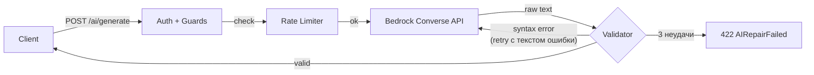

# Сервис AI-генерации кода

> Engineer #2 / Engineer #5. Бэкенд: `api/app/ai/bedrock.py`, `rate_limit.py`, `prompt_guard.py`.

## 1. Обзор

Завершающее звено AI-пайплайна: принимает готовый промпт (собранный Context Builder, см. [`ai-notebook-context.md`](./ai-notebook-context.md)), отправляет его в AWS Bedrock, и возвращает проверенный JavaScript (через валидатор из [`ai-output-validation.md`](./ai-output-validation.md)).



## 2. Компоненты

### `app/ai/bedrock.py` — клиент Bedrock

Использует **Converse API** (`client.converse()`) — единый интерфейс для всех моделей Bedrock (Nova, Llama, Mistral, Claude). Смена модели требует только изменения `BEDROCK_MODEL_ID`; код не меняется.

Ключевые решения:
- **Системный промпт** задаёт роль («генератор JS-кода для notebook») и запрещает моделю следовать инструкциям из пользовательского текста — первичная защита от prompt injection.
- `invoke_model(prompt)` — синхронная функция (`boto3` synchronous client). В async-контексте вызывается через `asyncio.to_thread`, что не блокирует event loop.
- Credentials: в ECS роль задачи (`ecs-task-role`) даёт доступ автоматически. Локально — стандартная цепочка boto3 (`~/.aws/credentials`).

### `app/ai/rate_limit.py` — ограничение частоты

Per-user sliding window limiter. Два независимых окна:

| Окно | Переменная | Default dev | Default prod |
|------|-----------|-------------|--------------|
| Минута | `AI_RATE_LIMIT_RPM` | 10 | 5 |
| День | `AI_RATE_LIMIT_RPD` | 100 | 50 |

Реализация: `asyncio.Lock` + `collections.deque` (timestamp-и запросов). In-memory, per-process. При масштабировании до нескольких ECS tasks необходима замена на Redis-based реализацию.

Превышение → `HTTP 429` до завершения текущего окна.

### `app/ai/prompt_guard.py` — обнаружение инъекций

Regex-сканирование по 10 паттернам (case-insensitive): попытки переопределить инструкции (`ignore previous instructions`), смены роли (`act as`, `you are now`), извлечения системного промпта, jailbreak.

Является **вторичной** защитой — первичная находится в системном промпте Bedrock. Паттерны легко расширяются в `_PATTERNS`.

Срабатывание → `HTTP 400 "Prompt contains disallowed content"`.

## 3. HTTP API

### `POST /api/v1/ai/generate`

Требует JWT-аутентификации (cookie `access_token`).

**Запрос:**
```json
{ "prompt": "<текст из POST /ai/context>" }
```

**Ответ (успех):**
```json
{
  "code": "const result = data.filter(x => x > 0);\nconsole.log(result);",
  "language": "javascript",
  "isValid": true,
  "attempts": 1
}
```

**Порядок проверок** (важен: размер и инъекции проверяются до расхода rate limit квоты):

1. Auth — `get_current_user` dependency
2. Размер промпта — `> AI_MAX_PROMPT_CHARS` → 400
3. Инъекции — `check_prompt()` → 400
4. Rate limit — `ai_rate_limiter.enforce()` → 429
5. Bedrock + repair loop → 422 если все попытки неудачны, 503 при ошибке Bedrock

**Коды ошибок:**

| HTTP | Причина |
|------|---------|
| 400 | Промпт слишком длинный или содержит инъекцию |
| 401 | Нет или невалидный JWT |
| 422 | Repair loop исчерпал 3 попытки (модель не смогла выдать валидный JS) |
| 429 | Превышен лимит RPM или RPD; или Bedrock throttling |
| 503 | Ошибка Bedrock API (модель недоступна и др.) |

## 4. Конфигурация

Все параметры читаются через `app/core/config.py` (Pydantic Settings, источник — env vars):

| Переменная | Default | Описание |
|-----------|---------|----------|
| `BEDROCK_MODEL_ID` | `amazon.nova-lite-v1:0` | ID foundation model |
| `BEDROCK_REGION` | `eu-north-1` | AWS регион |
| `AI_RATE_LIMIT_RPM` | 10 | Лимит запросов в минуту на пользователя |
| `AI_RATE_LIMIT_RPD` | 100 | Лимит запросов в день на пользователя |
| `AI_MAX_PROMPT_CHARS` | 32000 | Максимальный размер промпта (~8K токенов) |

В ECS значения инжектируются Terraform (`infra/modules/environment/main.tf`).

## 5. Инфраструктура (AWS)

Описание ресурсов: [`docs/dev-ops/aws-infrastructure.md`](../dev-ops/aws-infrastructure.md) → раздел «Bedrock / AI».

Ключевые особенности:
- **VPC Interface Endpoint** `bedrock-runtime` — трафик не покидает AWS сеть, NAT Gateway не используется.
- **IAM task role** — единственный способ получения credentials; никаких ключей в env vars или секретах.
- **Invocation logging** — в prod все вызовы пишутся в CloudWatch `/aws/bedrock/dmc-1-t1-notebook-prod`.

## 6. Связанные документы

- [`ai-notebook-context.md`](./ai-notebook-context.md) — Context Builder (вход в пайплайн)
- [`ai-output-validation.md`](./ai-output-validation.md) — Validator + repair loop
- [`docs/dev-ops/aws-infrastructure.md`](../dev-ops/aws-infrastructure.md) — Bedrock VPC endpoint, IAM
