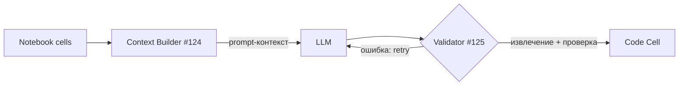

# Контекст Notebook для LLM (Context Builder)

> Реализация задачи [#124](https://github.com/larchanka-training/js-notebook/issues/124)
> (Engineer #3). Бэкенд: `api/app/ai/context.py`.

## 1. Обзор

Перед генерацией кода по Prompt Cell модели полезно «видеть» предыдущие ячейки
notebook: пояснения в markdown, ранее написанный код и результаты его
выполнения (outputs). **Context Builder** собирает эти данные в детерминированный
текст, который подставляется в промпт перед обращением к LLM.

Это вход в пайплайн валидации/repair из задачи
[#125](https://github.com/larchanka-training/js-notebook/issues/125):



## 2. Что попадает в контекст

Включаются **только ячейки до** Prompt Cell (`target_cell_id`). Для каждой:

- **markdown** — текст ячейки как есть (пояснения, заголовки);
- **code** — исходный код в fenced-блоке ` ```js `;
- **outputs** code-ячеек — результат выполнения (опционально).

`raw`-ячейки по умолчанию пропускаются.

### Нормализация outputs (`render_output`)

Поддерживаются типы output из модели UI (`ui/.../model/types.ts`):

| Тип output | Представление в контексте |
|------------|---------------------------|
| `execute_result` | текст результата |
| `stream` (stdout) | текст потока |
| `stream` (stderr) | `[stderr] <текст>` |
| `error` | `[error] <ename>: <evalue>` |

Неизвестные/отсутствующие outputs дают пустую строку.

## 3. API

`build_context(cells, *, target_cell_id=None, include_outputs=True,
include_markdown=True, include_raw=False, max_cells=20,
max_source_chars=2000, max_output_chars=1000) -> NotebookContext`

- `target_cell_id` — id Prompt Cell; включаются ячейки строго до неё
  (`None` — все ячейки).
- Лимиты защищают промпт от раздувания: при превышении `max_cells` берутся
  **последние** (ближайшие к Prompt Cell) ячейки; длинные `source`/`output`
  усекаются маркером `… [truncated]`. Любой лимит можно отключить значением
  `None`.

`NotebookContext.to_prompt()` возвращает готовый markdown-текст контекста,
`NotebookContext.cells` — структурированные `ContextCell`
(`index`, `id`, `type`, `source`, `output`, флаги усечения).

## 4. HTTP API

`POST /api/v1/ai/context` — собрать контекст (без обращения к LLM):

**Запрос:**
```json
{
  "cells": [
    { "id": "m1", "type": "markdown", "source": "# Setup" },
    { "id": "c1", "type": "code", "source": "const x = 1;",
      "output": { "type": "execute_result", "text": "1" } },
    { "id": "prompt", "type": "code", "source": "// task" }
  ],
  "targetCellId": "prompt",
  "includeOutputs": true
}
```

**Ответ:**
```json
{
  "prompt": "## Notebook context (previous cells)\n\n### Cell 1 [markdown]\n# Setup\n\n### Cell 2 [code]\n```js\nconst x = 1;\n```\nOutput:\n```\n1\n```",
  "cells": [
    { "index": 1, "id": "m1", "type": "markdown", "source": "# Setup",
      "output": "", "sourceTruncated": false, "outputTruncated": false },
    { "index": 2, "id": "c1", "type": "code", "source": "const x = 1;",
      "output": "1", "sourceTruncated": false, "outputTruncated": false }
  ],
  "totalCells": 3,
  "includedCells": 2,
  "truncated": false
}
```

Эндпоинт stateless и не требует авторизации (не обращается к данным
пользователя).

## 5. Тестирование

`api/tests/test_ai_context.py` — нормализация outputs, отбор предыдущих ячеек,
включение markdown/кода/outputs, лимиты и усечение.
`api/tests/test_ai_endpoint.py` — эндпоинт `POST /ai/context`.

```bash
cd api && pytest tests/test_ai_context.py tests/test_ai_endpoint.py
```
