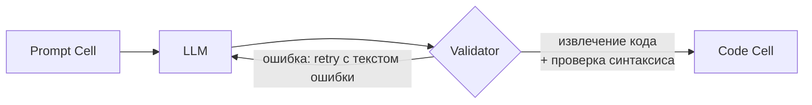

# Валидация и «починка» ответов ИИ (AI Output Validation & Repair)

> Реализация задачи [#125](https://github.com/larchanka-training/js-notebook/issues/125)
> (Engineer #4). Бэкенд: `api/app/ai/`.

## 1. Обзор

> **Связанное:** сборка контекста notebook (предыдущие ячейки, markdown, код,
> outputs), который подставляется в промпт перед обращением к LLM, описана в
> [`ai-notebook-context.md`](./ai-notebook-context.md) (Engineer #3, issue #124).

Пользователь описывает желаемый код в Prompt Cell, запрос уходит в LLM, ответ
модели **нельзя выводить в Code Cell напрямую**: модели возвращают результат
по-разному (код в markdown-ограждении, с пояснениями, без ограждений, на разных
языках, иногда с синтаксическими ошибками). Этот модуль нормализует ответ,
извлекает исполняемый JavaScript, проверяет синтаксис и при необходимости
запускает retry-цикл с передачей информации об ошибке обратно в LLM.



## 2. Пайплайн

| Шаг | Функция | Назначение |
|-----|---------|-----------|
| Извлечение кода | `extract_code(raw)` | Достать исполняемый код из произвольного ответа LLM |
| Проверка синтаксиса | `SyntaxValidator.validate(code)` | Найти синтаксические ошибки JS |
| Валидация ответа | `validate_ai_output(raw)` | Связка извлечения + проверки → `ValidationResult` |
| Repair-цикл | `generate_validated_code(prompt, regenerate)` | Повторные попытки с передачей ошибки в LLM |

## 3. Извлечение кода — форматы ответов моделей

`extract_code` толерантен к тому, как именно ответила модель:

- ````` ```js ` / ` ```javascript ` / ` ```ts ` / ` ```node ` ````` — fenced-блок с языком;
- ````` ``` ````` — fenced-блок без указания языка;
- несколько fenced-блоков — JS-блоки выбираются и склеиваются (не-JS, например
  ` ```bash `, отбрасываются);
- код вперемешку с текстом-пояснением — извлекается только код из блока;
- **незакрытое** ограждение (модель оборвала ответ) — берётся остаток текста;
- ответ без ограждений — весь текст трактуется как код (best-effort);
- обрамляющие одиночные backtick-и (`` `code` ``) снимаются.

Возвращает `(code, language)`. Бросает `AIEmptyResponse` (пустой ответ) или
`AICodeNotFound` (ограждение есть, но пустое).

## 4. Проверка синтаксиса

Проверка вынесена за протокол `SyntaxValidator` (внедряемая зависимость), что
упрощает тестирование и замену движка:

- **`EsprimaSyntaxValidator`** (по умолчанию) — парсер [`esprima`](https://pypi.org/project/esprima/)
  на чистом Python (ES2017). Возвращает точные ошибки с номером строки/колонки.
  Пробует разобрать код и как script, и как ES-модуль (`import`/`export`).
  **Ограничение:** часть синтаксиса ES2020+ (optional chaining `?.`, nullish
  coalescing `??`) может отклоняться. В реальном движке (QuickJS WASM, см.
  `execution-architecture.md`) такой код исполнится — это компромисс backend-проверки.
- **`StructuralSyntaxValidator`** (fallback) — без внешних зависимостей: баланс
  скобок `(){}[]`, кавычек, шаблонных строк (с интерполяцией `${…}`), учёт
  строк и комментариев. Менее точен (не распознаёт regex-литералы), но
  безопасен для современного синтаксиса.

`get_default_validator()` выбирает `esprima`, а при его отсутствии (ImportError)
откатывается на структурную проверку.

## 5. Repair-цикл

`generate_validated_code(prompt, regenerate, *, max_attempts=3, validator=None)`:

1. Вызывает `regenerate(prompt, last_result)` — обёртку над LLM. На первой
   попытке `last_result is None`, далее передаётся предыдущий неуспешный
   `ValidationResult` (используйте `last_result.error_summary()` для уточняющего
   промпта).
2. Валидирует ответ через `validate_ai_output`.
3. При успехе возвращает `ValidationResult` (с номером попытки `attempt`).
4. Исчерпав `max_attempts`, бросает `AIRepairFailed` (с `attempts` и
   `last_result`).

LLM-клиент намеренно абстрагирован через колбэк `regenerate`, поэтому модуль не
зависит от конкретного провайдера и легко тестируется моками.

## 6. HTTP API

`POST /api/v1/ai/validate` — валидация одного ответа ИИ (без обращения к LLM):

**Запрос:**
```json
{ "raw": "Sure!\n```js\nconst x = 1;\nconsole.log(x);\n```" }
```

**Ответ:**
```json
{
  "isValid": true,
  "code": "const x = 1;\nconsole.log(x);",
  "language": "javascript",
  "reason": "ok",
  "issues": [],
  "validator": "esprima"
}
```

`reason` ∈ `ok | empty | no_code | syntax`. При `syntax` массив `issues`
содержит `{ message, line, column }`. Эндпоинт stateless и не требует
авторизации (не обращается к данным пользователя).

## 7. Исключения (`app/ai/exceptions.py`)

```text
AIError
├── AIEmptyResponse   — пустой ответ LLM
├── AICodeNotFound    — код не найден
├── AISyntaxError     — код не прошёл проверку синтаксиса
└── AIRepairFailed    — repair-цикл исчерпал попытки
```

## 8. Тестирование

`api/tests/test_ai_validation.py` — извлечение кода (форматы моделей),
структурный и esprima-валидаторы, repair-цикл (моки LLM).
`api/tests/test_ai_endpoint.py` — эндпоинт `POST /ai/validate`.

```bash
cd api && pytest tests/test_ai_validation.py tests/test_ai_endpoint.py
```
