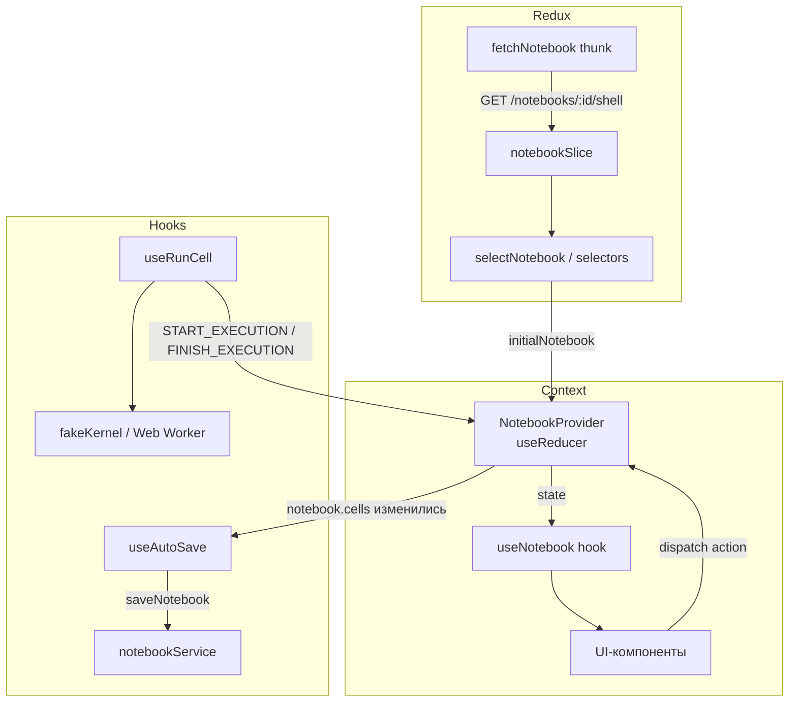

# Модель блокнота (Notebook Model)

## 1. Обзор

Этот документ описывает модель данных и управление состоянием блокнота на стороне UI. Модель разделена на два независимых слоя:

- **Redux (server state)** — хранит облегчённое представление блокнота (`NotebookShell`), загруженное с сервера.
- **React Context + useReducer (local state)** — хранит полный объект `Notebook` с ячейками и управляет всеми локальными мутациями (добавление, удаление, редактирование, выполнение ячеек).

Такое разделение позволяет держать серверный кэш и локальные изменения изолированными друг от друга.

---

## 2. Доменная модель

Все типы определены в `ui/src/features/notebook/model/types.ts`.

### 2.1 Notebook

Главная сущность, передаётся в `NotebookProvider` при открытии страницы блокнота.

```typescript
interface Notebook {
  id: string;
  metadata: NotebookMetadata;   // { title, custom? }
  cells: Cell[];
  createdAt: string;            // ISO 8601
  updatedAt: string;            // ISO 8601, обновляется при каждом действии
}
```

### 2.2 Cell

Дискриминированный union из трёх вариантов:

```typescript
type Cell = CodeCell | MarkdownCell | RawCell;
```

| Тип | Поля помимо `CellBase` | Назначение |
|---|---|---|
| `CodeCell` | `executionCount`, `output`, `executionState` | Исполняемый JS-код |
| `MarkdownCell` | — | Разметка (Markdown) |
| `RawCell` | — | Произвольный текст без интерпретации |

`CellBase` содержит: `id`, `source`, `metadata?` (`collapsed?`, `custom?`).

### 2.3 ExecutionState

Жизненный цикл ячейки типа `code`:

```
idle  →  running  →  idle    (успех)
                  →  error   (ошибка выполнения)
```

Состояние `queued` зарезервировано для будущей очереди выполнения нескольких ячеек подряд.

### 2.4 CellOutput

```typescript
type CellOutput = StreamOutput | ExecuteResultOutput | ErrorOutput;
```

| Тип | Поля | Когда используется |
|---|---|---|
| `StreamOutput` | `stream: "stdout"\|"stderr"`, `text` | `console.log`, `console.error` и т.д. |
| `ExecuteResultOutput` | `text` | Возвращаемое значение последнего выражения |
| `ErrorOutput` | `ename`, `evalue`, `traceback[]` | Ошибка выполнения |

Пустой `StreamOutput` (`text: ""`) используется как sentinel «вывода ещё нет» — `CellOutputView` ничего не рендерит в этом случае.

### 2.5 NotebookShell

Облегчённая проекция `Notebook` для листинга и Redux-хранилища. Содержит только мета-данные и краткое описание ячеек без полного исходного кода.

```typescript
interface NotebookShell {
  id: string;
  title: string;
  language: string;
  kernelStatus: NotebookKernelStatus;   // "idle" | "starting" | "ready" | "error"
  cells: Array<{ id, type, title, preview }>;
}
```

---

## 3. Управление состоянием

### 3.1 Redux — серверный слой (`notebookSlice`)

Хранит `NotebookShell` и статус загрузки. Используется для начальной загрузки блокнота с сервера.

```
state.notebook = {
  notebook: NotebookShell | null,
  status:   "idle" | "loading" | "succeeded" | "failed",
  error:    string | null,
}
```

**Thunk:** `fetchNotebook` — загружает `NotebookShell` через `notebookService.getNotebook()`. При ошибке помещает сообщение в `state.notebook.error`.

**Селекторы** (`selectors.ts`):

| Селектор | Возвращает |
|---|---|
| `selectNotebook` | `NotebookShell \| null` |
| `selectNotebookStatus` | `NotebookRequestStatus` |
| `selectNotebookError` | `string \| null` |

### 3.2 React Context — локальный слой (`NotebookContext`)

Управляет полным объектом `Notebook` через `useReducer`. Используется для всех мутаций в рамках открытой страницы блокнота.

**Провайдер:** `NotebookProvider` принимает `initialNotebook` и `initialSelectedCellId`, создаёт стейт и пробрасывает `{ state, dispatch }` через контекст.

**Хук:** `useNotebook()` — возвращает `{ state, dispatch }`. Бросает ошибку, если вызван вне `NotebookProvider`.

**Стейт контекста:**

```typescript
interface State {
  notebook: Notebook;
  ui: { selectedCellId: string | null };
}
```

`ui` хранит локальный UI-стейт, который не персистируется.

---

## 4. Actions и редьюсер

Все действия создаются через фабрики `notebookActions`, которые инжектируют недетерминированные значения (`crypto.randomUUID()`, `new Date().toISOString()`). Это обеспечивает чистоту редьюсера.

| Action | Ключевые параметры | Поведение |
|---|---|---|
| `ADD_CELL` | `newCell`, `afterCellId?` | Вставляет ячейку после указанной (или в конец). Выделяет новую ячейку |
| `DELETE_CELL` | `cellId` | Удаляет ячейку, переводит фокус на соседнюю |
| `UPDATE_CELL_SOURCE` | `cellId`, `source` | Обновляет исходный код ячейки |
| `CHANGE_CELL_TYPE` | `cellId`, `newType` | Меняет тип ячейки, сбрасывает execution-специфичные поля при переходе в `code` |
| `MOVE_CELL` | `cellId`, `direction` | Меняет ячейку местами с соседней. Игнорирует граничные позиции |
| `SELECT_CELL` | `cellId \| null` | Устанавливает выделенную ячейку |
| `START_EXECUTION` | `cellId` | Переводит ячейку в `running`, сбрасывает вывод |
| `FINISH_EXECUTION` | `cellId`, `output`, `executionCount`, `status` | Записывает результат, переводит в `idle` или `error`, раскрывает вывод |
| `RESTART_KERNEL` | — | Сбрасывает все code-ячейки в `idle`, очищает вывод и `executionCount` |
| `TOGGLE_OUTPUT_COLLAPSED` | `cellId` | Переключает `metadata.collapsed` ячейки |
| `UPDATE_TITLE` | `title` | Обновляет `metadata.title` блокнота |

Каждое действие, меняющее `Notebook`, обновляет `notebook.updatedAt` через переданное поле `now`.

---

## 5. Хуки

### 5.1 `useRunCell`

Оркестрирует запуск ячейки:

1. Находит ячейку по `cellId`, проверяет тип `code`.
2. Диспатчит `START_EXECUTION`.
3. Вызывает `executeCode(cell.source)` (сейчас — `fakeKernel`, в будущем — Web Worker).
4. Диспатчит `FINISH_EXECUTION` с результатом.
5. При успехе автоматически выделяет следующую ячейку.

### 5.2 `useAutoSave`

Автоматически сохраняет блокнот при изменении `notebook.cells`:

- Дебаунс: **800 мс** (константа `AUTOSAVE_DEBOUNCE_MS` в `config.ts`).
- При каждом срабатывании отменяет предыдущий in-flight запрос через `AbortController`.
- Использует `useRef` для доступа к актуальному состоянию блокнота внутри дебаунс-колбэка — это предотвращает захват устаревшего значения через замыкание.
- Первый рендер пропускается — сохранение не вызывается при монтировании провайдера.
- При анмаунте отменяет таймер и активный запрос.

> Изменения заголовка (`UPDATE_TITLE`) не меняют `notebook.cells`, поэтому не триггерят автосохранение.

---

## 6. Сервисный слой

`notebookService` (`ui/src/features/notebook/api/notebookService.ts`) предоставляет единый интерфейс для работы с данными. Реализация переключается флагом `USE_MOCK`.

| Метод | Mock | API |
|---|---|---|
| `getAllNotebooks()` | `localStorage` | `GET /notebooks` |
| `getNotebook(id)` | `localStorage` | `GET /notebooks/:id/shell` |
| `getNotebookById(id)` | `localStorage` | `GET /notebooks/:id` |
| `saveNotebook(notebook, signal?)` | `localStorage` + `AbortSignal` | `PUT /notebooks/:id` *(TODO)* |
| `createNotebook(title?)` | `localStorage` | `POST /notebooks` *(TODO)* |
| `deleteNotebook(id)` | `localStorage` | `DELETE /notebooks/:id` *(TODO)* |

**Mock-режим** хранит данные в `localStorage` под ключом `dmc:notebooks` и имитирует задержку 250 мс.

**Проекция `toShell`**: при листинге `Notebook` преобразуется в `NotebookShell` — берётся первая строка `source` как заголовок ячейки, первые 120 символов — как превью. Raw-ячейки фильтруются.

---

## 7. Диаграмма потока данных


