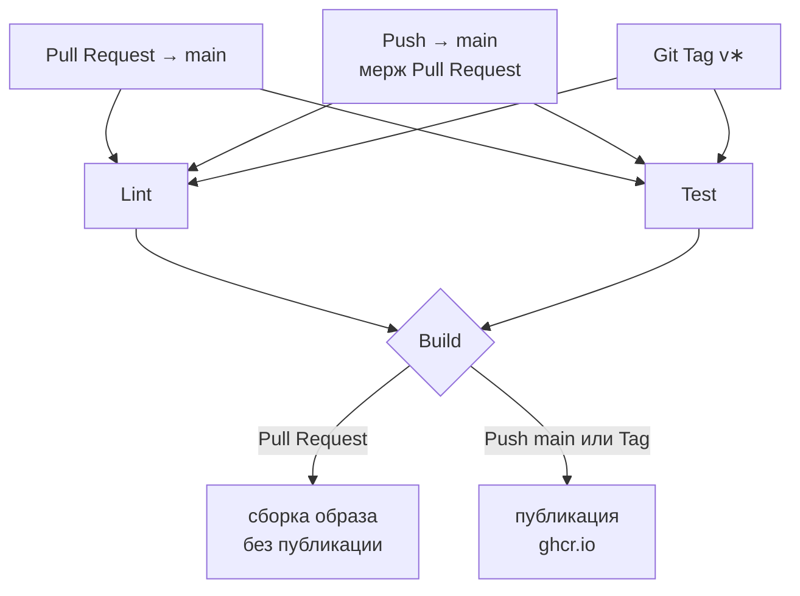
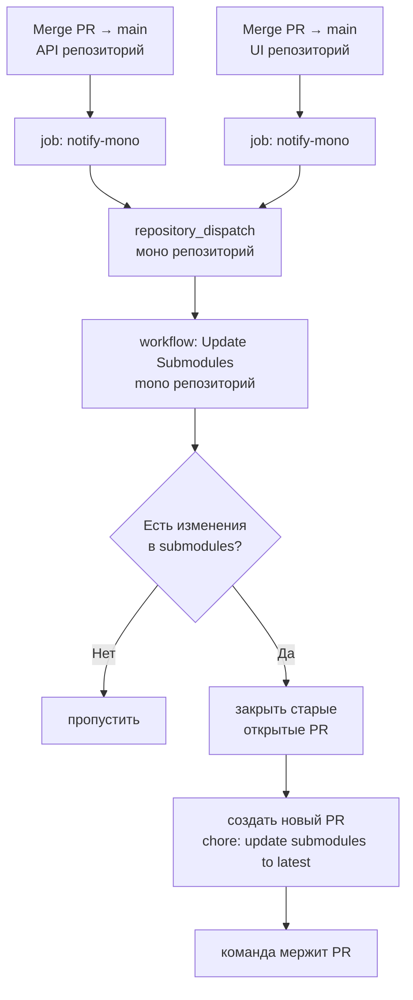

# CI/CD

## Обзор

В проекте используется GitHub Actions для автоматической проверки качества кода и сборки Docker-образов. Каждый репозиторий (UI и API) содержит единый файл `.github/workflows/ci-cd.yml` с тремя последовательными job-ами.



| Job | Триггер | Инструмент | Репозиторий |
|-----|---------|-----------|-------------|
| Lint | push, Pull Request | ruff | API |
| Lint | push, Pull Request | ESLint | UI |
| Test | push, Pull Request | pytest | API |
| Test | push, Pull Request | vitest | UI |
| Build | push → main, Git Tag | Docker | API + UI |

---

## Файл пайплайна

Оба репозитория используют один файл `.github/workflows/ci-cd.yml`. Отдельных `lint.yml` и `test.yml` нет — все три job-а описаны в одном месте, что позволяет использовать `needs:` для строгого порядка выполнения.

```yaml
jobs:
  lint:   # запускается параллельно с test
  test:   # запускается параллельно с lint
  build:
    needs: [lint, test]   # стартует только если оба зелёные
```

---

## Lint

### API (ruff)

[ruff](https://docs.astral.sh/ruff/) — быстрый Python linter, проверяет стиль и качество кода в директории `app/`.

Запустить локально:
```bash
pip install ruff
ruff check app/
```

Автоматическое исправление части ошибок:
```bash
ruff check app/ --fix
```

### UI (ESLint)

[ESLint](https://eslint.org/) проверяет JavaScript/TypeScript код. Конфигурация находится в `eslint.config.js`.

Запустить локально:
```bash
npm run lint
```

---

## Test

### API (pytest)

[pytest](https://pytest.org/) — фреймворк для Unit Test-ов на Python. Тесты находятся в папке `tests/`.

Запустить локально:
```bash
pip install -r requirements-dev.txt
pytest
```

### UI (vitest)

[vitest](https://vitest.dev/) — фреймворк для Unit Test-ов, совместимый с Vite. Тесты находятся рядом с компонентами или в папке `tests/`.

Запустить локально:
```bash
npm test
```

---

## Зависимости Python: requirements.txt vs requirements-dev.txt

В API репозитории используются два файла зависимостей:

| Файл | Назначение | Где используется |
|------|-----------|-----------------|
| `requirements.txt` | Продакшн-зависимости (FastAPI, OTel, uvicorn и др.) | `Dockerfile` при сборке образа |
| `requirements-dev.txt` | Dev и CI зависимости (pytest, ruff, httpx) | GitHub Actions, локальная разработка |

`requirements-dev.txt` включает продакшн-зависимости через строку `-r requirements.txt`, поэтому для локальной разработки и CI достаточно установить только его:

```bash
pip install -r requirements-dev.txt
```

Это гарантирует, что в CI тестируется код с теми же версиями библиотек, что и в продакшн-образе.

---

## Build: Docker-образы

### Что собирается

| Образ | Репозиторий |
|-------|------------|
| `ghcr.io/larchanka-training/dmc-1-t1-notebook-api` | dmc-1-t1-notebook-api |
| `ghcr.io/larchanka-training/dmc-1-t1-notebook-ui` | dmc-1-t1-notebook-ui |

Образы публикуются в [GitHub Container Registry (ghcr.io)](https://ghcr.io) — бесплатный реестр, не требует отдельных аккаунтов.

Наши образы тут:
* [API](https://github.com/larchanka-training/dmc-1-t1-notebook-api/pkgs/container/dmc-1-t1-notebook-api)
* [UI](https://github.com/larchanka-training/dmc-1-t1-notebook-ui/pkgs/container/dmc-1-t1-notebook-ui)

### Теги образов

Образ получает разные теги в зависимости от того, что запустило пайплайн:

| Событие | Теги образа | Пример |
|---------|------------|--------|
| Merge Pull Request → main | `latest`, `sha-<hash>` | `latest`, `sha-ab12cd3` |
| Git Tag `v*` | `v<версия>`, `sha-<hash>` | `v1.2.0`, `sha-ab12cd3` |
| Pull Request (без мержа) | образ собирается, но **не публикуется** | — |

Тег `sha-*` всегда указывает на конкретный коммит, что позволяет откатиться к любой предыдущей версии.

### Версионные теги через Git Tag

Для создания версионного образа достаточно поставить Git Tag:

```bash
git tag v1.0.0
git push origin v1.0.0
```

GitHub Actions автоматически соберёт и опубликует образ с тегом `v1.0.0`.

Посмотреть опубликованные образы: `https://github.com/orgs/larchanka-training/packages`

---

## Переменные окружения

Полный список с дефолтными значениями находится в `.env.example` в корне Mono репозитория.

| Переменная | Обязательная | Описание |
|-----------|-------------|---------|
| `POSTGRES_USER` | да | Имя пользователя PostgreSQL |
| `POSTGRES_PASSWORD` | да | Пароль PostgreSQL |
| `POSTGRES_DB` | да | Имя базы данных |
| `DATABASE_URL` | да | Строка подключения API к БД |
| `PGADMIN_EMAIL` | да | Email для входа в pgAdmin |
| `PGADMIN_PASSWORD` | да | Пароль pgAdmin |
| `OAUTH_CLIENT_ID` | для OAuth | ID OAuth-приложения |
| `OAUTH_CLIENT_SECRET` | для OAuth | Секрет OAuth-приложения |
| `TOKEN_TTL_SECONDS` | нет | Время жизни токена (по умолчанию 86400 = 24ч) |
| `SESSION_TTL_SECONDS` | нет | Время жизни сессии (по умолчанию 604800 = 7 дней) |
| `OTEL_ENABLED` | нет | Включить OpenTelemetry (по умолчанию `false`) |
| `OTEL_ENDPOINT` | нет | Адрес OTLP endpoint (по умолчанию `http://aspire-dashboard:18889`) |
| `OTEL_SERVICE_NAME` | нет | Имя сервиса в трейсах |

### Секреты GitHub Actions

Для работы Build пайплайна дополнительные секреты не нужны — `GITHUB_TOKEN` создаётся автоматически для каждого запуска и имеет право на публикацию в `ghcr.io`.

Для автоматического обновления submodules в Mono репозитории используется отдельный секрет `MONO_REPO_PAT` — подробнее в разделе [Автоматическое обновление submodules](#автоматическое-обновление-submodules).

Для будущего деплоя на staging/production потребуются дополнительные секреты (TBD).

---

## Автоматическое обновление submodules

Mono репозиторий использует git submodules для отслеживания актуальных версий API и UI. Чтобы pointer submodule всегда указывал на последний коммит `main` — обновление автоматизировано через GitHub Actions.

### Схема работы



### Участвующие файлы

| Файл | Репозиторий | Роль |
|------|-------------|------|
| `.github/workflows/ci-cd.yml` | API, UI | Содержит job `notify-mono` — отправляет событие в mono после успешного build на main |
| `.github/workflows/update-submodules.yml` | Mono | Слушает событие, обновляет submodules, создаёт PR |

### job: notify-mono (API и UI репозитории)

Добавлен в конец существующего `ci-cd.yml`. Запускается только при push в `main` после успешного `build` job:

```yaml
notify-mono:
  needs: [build]
  if: github.ref == 'refs/heads/main' && github.event_name == 'push'
  steps:
    - uses: peter-evans/repository-dispatch@v3
      with:
        token: ${{ secrets.MONO_REPO_PAT }}
        repository: larchanka-training/dmc-1-t1-notebook-mono
        event-type: submodule-update
```

### workflow: Update Submodules (Mono репозиторий)

Файл `.github/workflows/update-submodules.yml`. Алгоритм:

1. Checkout mono репозитория с submodules
2. `git submodule update --remote --force` — получить последние коммиты из API и UI
3. Если изменений нет — завершить без действий
4. Закрыть все открытые PR с заголовком `chore: update submodules to latest` (чтобы не накапливались)
5. Создать новый PR с обновлёнными submodule pointers

### Секрет MONO_REPO_PAT

Для cross-repo взаимодействия используется Fine-grained Personal Access Token.

| Параметр | Значение |
|----------|---------|
| Тип | Fine-grained PAT |
| Репозитории | api, ui, mono |
| Permissions | Actions: Read and write, Contents: Read and write, Pull requests: Read and write, Metadata: Read-only |

Секрет добавлен под именем `MONO_REPO_PAT` в Settings → Secrets and variables → Actions каждого из трёх репозиториев.

### Почему не прямой push в main

Mono репозиторий защищён Ruleset с обязательным PR перед мержем. `github-actions[bot]` недоступен как bypass актор в настройках организации, поэтому workflow создаёт PR вместо прямого push.

---

## Как читать результаты CI

1. Открыть Pull Request на GitHub
2. В разделе **Checks** (внизу страницы PR) видны статусы: `Lint`, `Test`, `Build`
3. Клик на **Details** → лог выполнения каждого шага
4. 🔴 Красный крест = job упал, мерж заблокирован
5. ✅ Зелёная галочка = всё прошло

---

## Troubleshooting

| Проблема | Причина | Решение |
|---------|---------|---------|
| `ModuleNotFoundError: No module named 'opentelemetry'` | В CI установлен только `requirements-dev.txt` без `-r requirements.txt` | Убедиться что `requirements-dev.txt` содержит строку `-r requirements.txt` |
| Lint падает на CI, но не локально | Разные версии инструментов | Использовать `npm ci` вместо `npm install`; установить ruff той же версии |
| `Cannot start service: Host version X does not match binary version Y` | Устаревший Docker volume с `node_modules` | `docker compose down -v && docker compose up --build` |
| Build job не запускается | Lint или Test упали | Исправить ошибки в Lint/Test — Build запустится автоматически |
| Образ не появился в ghcr.io после мержа | Build job упал или триггер не совпал | Проверить вкладку **Actions** в репозитории |
