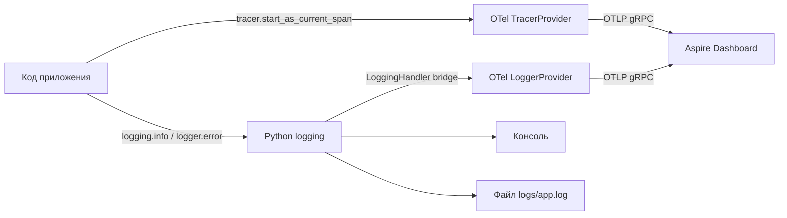

# Observability: логирование и OpenTelemetry

## Обзор

API использует двухуровневую систему наблюдаемости:

- **Логирование** — структурированные JSON-логи через стандартный Python `logging`
- **OpenTelemetry (OTel)** — распределённые трейсы и экспорт логов в [Aspire Dashboard](https://learn.microsoft.com/en-us/dotnet/aspire/fundamentals/dashboard/overview)



---

## Логирование

### Конфигурация

Управляется переменными окружения:

| Переменная | По умолчанию | Описание |
|-----------|-------------|---------|
| `LOG_LEVEL` | `DEBUG` | Минимальный уровень логов |
| `LOG_LEVEL_CONSOLE` | `DEBUG` | Уровень для вывода в консоль |
| `LOG_LEVEL_FILE` | `INFO` | Уровень для записи в файл |
| `ENABLE_FILE_LOGGING` | `true` | Включить запись в файлы |
| `LOG_RETENTION_DAYS` | `14` | Сколько дней хранить лог-файлы |

### Формат

В консоли логи выводятся в JSON-формате:
```json
{
  "timestamp": "2026-05-15T13:45:51.242929+00:00",
  "level": "INFO",
  "service": "dmc-1-t1-notebook-api",
  "name": "app.api.v1.endpoints.health",
  "message": "Health check called",
  "trace_id": "6183c65dea4aeaf0a69ec77c6060f11d",
  "user_id": null
}
```

Поле `trace_id` автоматически заполняется из активного OTel span-а — это позволяет связать лог с конкретным запросом в Aspire Dashboard.

### Использование в коде

```python
import logging

logger = logging.getLogger(__name__)

# Обычный лог
logger.info("Пользователь авторизован")

# Лог с дополнительными полями
logger.info("Запрос обработан", extra={"user_id": 42, "duration_ms": 120})

# Уровни
logger.debug("Детальная отладочная информация")
logger.warning("Что-то пошло не так, но не критично")
logger.error("Ошибка при обработке запроса")
```

---

## OpenTelemetry

### Включение

По умолчанию OTel выключен. Для включения в `.env`:

```
OTEL_ENABLED=true
OTEL_ENDPOINT=http://aspire-dashboard:18889
OTEL_SERVICE_NAME=dmc-1-t1-notebook-api
```

При `OTEL_ENABLED=false` все вызовы OTel работают как no-op — код не нужно менять.

### Что инструментируется автоматически

При включённом OTel FastAPI автоматически создаёт span для каждого HTTP-запроса через `FastAPIInstrumentor`. В Aspire Dashboard они видны во вкладке **Traces** со всеми атрибутами: метод, URL, статус код, время выполнения.

### Aspire Dashboard

После `docker compose up` с `OTEL_ENABLED=true` открой [http://localhost:18888](http://localhost:18888):

- **Traces** — дерево span-ов для каждого запроса
- **Structured** — структурированные логи с привязкой к trace
- **Metrics** — метрики (если настроены)

---

## Примеры: кастомные трейсы

### Создать span вручную

```python
import logging
from opentelemetry import trace

logger = logging.getLogger(__name__)
tracer = trace.get_tracer(__name__)


def process_document(doc_id: int) -> dict:
    with tracer.start_as_current_span("document.process") as span:
        # Атрибуты span-а видны в Aspire Dashboard
        span.set_attribute("document.id", doc_id)
        span.set_attribute("document.source", "database")

        result = fetch_from_db(doc_id)

        # Лог автоматически получит trace_id текущего span-а
        logger.info("Документ обработан", extra={"doc_id": doc_id})

        return result
```

### Добавить Event в span

Event — это именованная временная метка внутри span-а. Удобно для отметки ключевых моментов.

```python
def import_data(source: str) -> None:
    with tracer.start_as_current_span("data.import") as span:
        span.set_attribute("import.source", source)

        # Event фиксирует момент начала загрузки
        span.add_event("download_started", {"url": source})
        data = download(source)

        span.add_event("parsing_started", {"rows": len(data)})
        parsed = parse(data)

        span.add_event("import_completed", {"inserted": len(parsed)})
```

### Вложенные span-ы

Дочерние span-ы автоматически привязываются к родительскому — в Aspire Dashboard видно дерево вызовов.

```python
def handle_request(user_id: int) -> dict:
    with tracer.start_as_current_span("request.handle") as span:
        span.set_attribute("user.id", user_id)

        # Вложенный span для обращения к БД
        user = get_user(user_id)
        docs = get_user_documents(user_id)

        return {"user": user, "documents": docs}


def get_user(user_id: int) -> dict:
    # Этот span будет дочерним по отношению к request.handle
    with tracer.start_as_current_span("db.get_user") as span:
        span.set_attribute("db.table", "users")
        span.set_attribute("user.id", user_id)
        return db.query(f"SELECT * FROM users WHERE id = {user_id}")


def get_user_documents(user_id: int) -> list:
    with tracer.start_as_current_span("db.get_user_documents") as span:
        span.set_attribute("db.table", "documents")
        span.set_attribute("user.id", user_id)
        return db.query(f"SELECT * FROM documents WHERE user_id = {user_id}")
```

### Записать ошибку в span

```python
import traceback
from opentelemetry.trace import StatusCode


def risky_operation() -> None:
    with tracer.start_as_current_span("risky.operation") as span:
        try:
            do_something()
        except Exception as e:
            # Пометить span как ошибочный
            span.set_status(StatusCode.ERROR, str(e))
            # Записать stack trace как событие
            span.record_exception(e)
            logger.error("Операция завершилась ошибкой", exc_info=True)
            raise
```

---

## Связь логов и трейсов

Когда OTel включён, каждый лог, написанный внутри активного span-а, автоматически получает `trace_id` и `span_id`. Это позволяет в Aspire Dashboard кликнуть на trace и сразу увидеть все связанные логи — и наоборот.

```python
with tracer.start_as_current_span("payment.process") as span:
    span.set_attribute("payment.amount", 100)

    # Этот лог будет автоматически связан с span-ом payment.process
    logger.info("Платёж инициирован", extra={"amount": 100})

    result = process_payment(100)

    logger.info("Платёж завершён", extra={"status": result.status})
```
